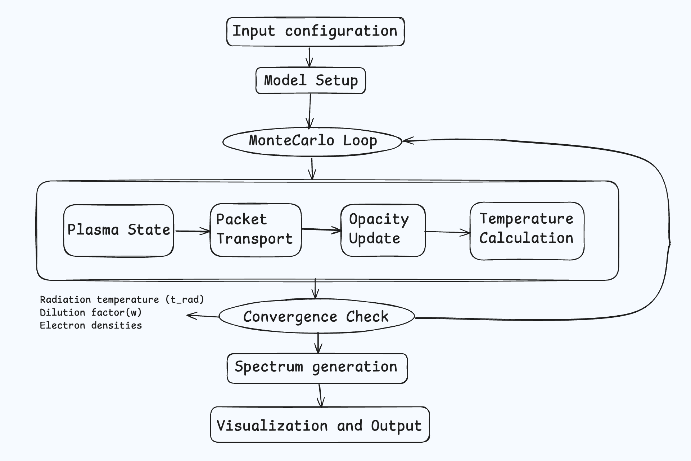
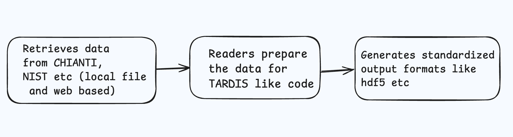
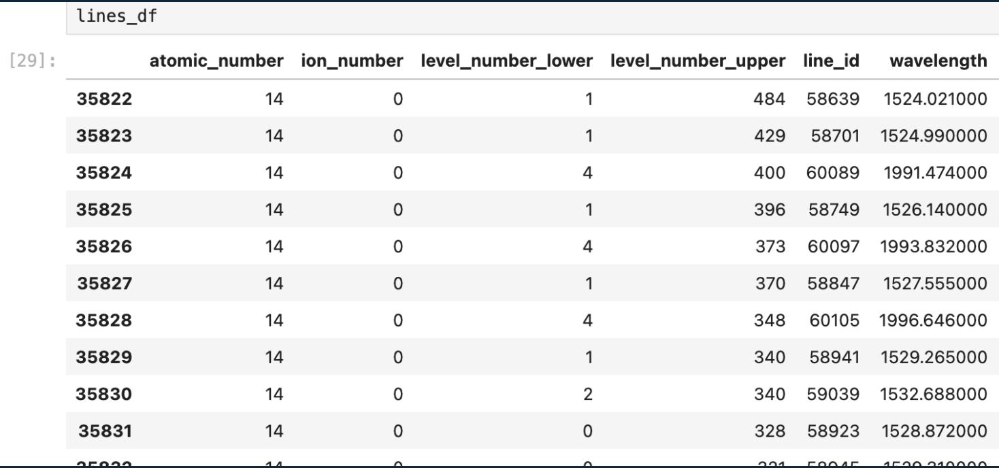
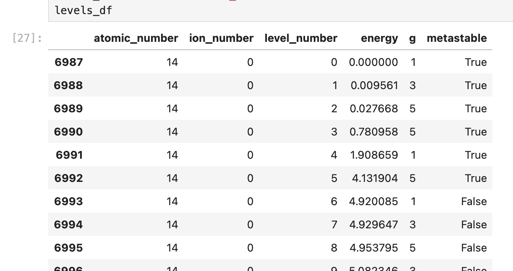
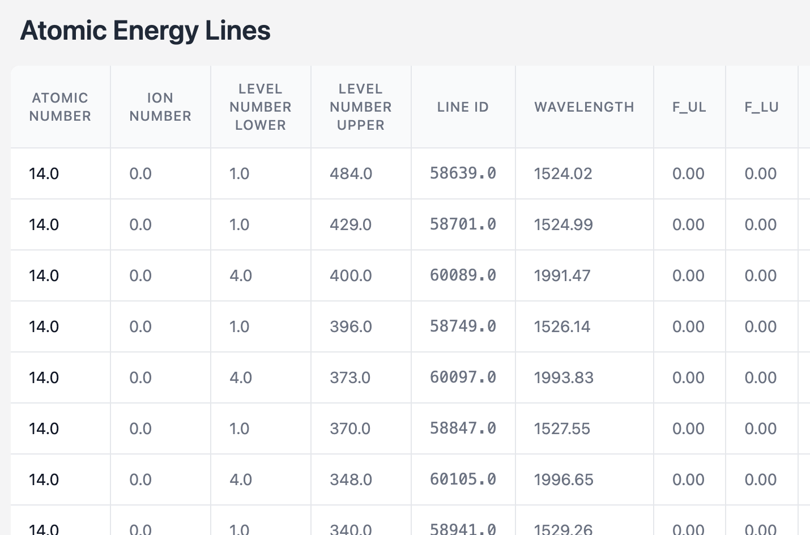
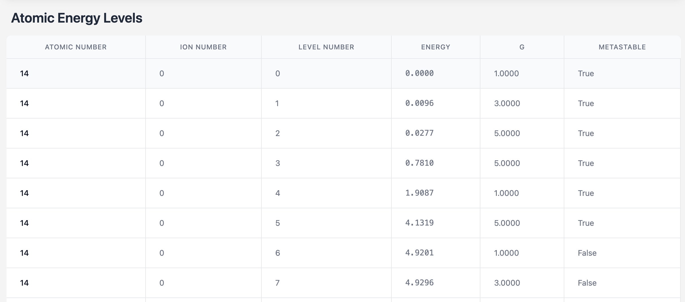

GSoC'25 Proposal - TARDIS RT Collaboration

# 
 CARSUS DASHBOARD 

### <u>Project Details</u>   
Project Title : CARSUS DASHBOARD

Mentors : [Josh Shields](https://github.com/jvshields)

Difficulty : HARD
 
### <u>Personal Information</u>   
Name : Karthik

Email : karthikrk11135@gmail.com

Github id : karthik11135

Brief Summary : A senior year college student from NIT Trichy, India. Interned at Capital One where I've worked on a python team. Over the past few months I've developed an interest towards open source and started looking into open source codebases. I like listening to music, window shopping and planning vacations. 

Resume : [Link to my Resume](https://drive.google.com/file/d/1LTs82Yv-aLM0iVrQHyoPOCQsfxLe_wFC/view?usp=sharing)

### <u>About the Organisation</u>  
TARDIS (Temperature And Radiative Diffusion In Supernovae) is an open-source radiative transfer code that is developed for simulating supernova spectra. At its core, TARDIS helps astrophysicsts understand how exploding stars appear to observers by creating synthetic spectra - essentially predicting what these cosmic explosions would look like through a telescope. Rather than taking days or weeks to simulate a spectrum, TARDIS uses sophisticated approximations  to generate while maintaining physical accuracy.

<u>Core Components of TARDIS</u>
| **Components**                         | **Description** |
|-------------------------------------|------------------------------------------------------------------|
| **Configuration & Input**            | <ul><li>Handles model parameters, atomic data, and abundance configurations (YAML or HDF).</li><li>Manages input/output of simulation data.</li></ul> |
| **Physical Model Setup**             | <ul><li>Establishes the radial grid structure (Radial 1D Geometry) and initial conditions.</li><li>Defines density profiles and abundance distributions across shells.</li></ul> |
| **Monte Carlo Radiation Transport** | <ul><li>Implements core Monte Carlo setup for packet propagation through shells.</li><li>Handles packet interactions including scattering, absorption, and re-emission.</li></ul> |
| **Plasma Physics**  | <ul><li>Calculates ionization states and level populations.</li><li>Manages atomic transitions and electron density calculations.</li></ul> |
| **Opacity Calculation**  | <ul><li>Computes line and continuum opacities for each shell.</li>
| **Monte Carlo Iteration Handler** | <ul><li>Controls the main iteration loop for temperature convergence.</li><li>Once the convergence happens the data is used to update plasma properties</li></ul> |
| **Spectrum Synthesis**   | <ul><li>Collects energy packets into observable spectra.</li>

<u> Flow Diagram </u>

#### <u>About CARSUS</u>  
Carsus is a package developed by the TARDIS team to manage and analyse atomic datasets. Carsus collects data from various sources like CHIANTI, NIST etc. It converts this data for use in radiative transfer code like TARDIS. It contains readers/parsers for each data source which perform initial validation and parsing. Carsus also handles unit conversions and data transformations. It prepares data in specific formats (CollisionsPreparer, LevelLinesPreparer etc)

Carsus enables researchers to:
- Analyze atomic energy levels and transition probabilities
- Study spectral line properties
- Investigate element composition in astrophysics
- Compare and validate data from different atomic databases
- Generate custom atomic datasets for specific research needs

<u>Flow Diagram</u>

### <u>Project Summary</u>  
The traditional way of getting insights from various atomic datasets is to run the scripts of carsus and look at the  tables. Astrophysicsts and researchers spend time in creating their custom atomic files, comparing two atomic files etc. This manual process is time-consuming and can slow down research progress. 

The Project - CARSUS Dashboard aims to streamline this workflow by providing a web-based application that facilitates numerous use cases. By enabling web access to different datasets, the project reduces the effort required to interact with Carsus, making data analysis faster and more efficient. Web access to various datasets will lessen the amount of time researchers have to deal with carsus to get insights. Built using Django and Jinja2, the application offers multiple API endpoints that allow users to request and visualize insights about atomic data. The dashboard provides an intuitive interface where researchers can interact with datasets

Some of the features of the application include:
1. Filtering data according to atomic numbers, ascending/descending order of wavelengths, line/level ids etc. 
2. Supports uploading and analyzing external atomic datasets
3. Provides features to compare different atomic datasets, helping researchers validate data across sources
4. System is designed to support both legacy atomic files and newer formats, ensuring long-term usability.
5. Includes thorough documentation and test coverage to maintain ease of use.

### <u>First Objective Task</u>  
Task : Use Jinja2 to generate an HTML Report that investigates an atomic file. Display top 50 rows of levels and lines dataframes from the atomic file for Silicon
Link to the github repo : [Solution](https://github.com/karthik11135/carsus-dashboard)

<u>Explanation</u> : Custom Atomic file is created using NIST's atomic weights and ionization energies. GFALL Reader is used to get the data of lines and levels for the Silicon atom. TARDISAtomData class is used to create the atom data. This atom data is loaded on the first server load. When the user hits the endpoint (/get_data) the first 50 rows of both lines and levels data is outputted on the screen. 

<u>Screenshots of the data</u>
<!-- 
 -->

| Lines | Levels |
|---------|---------|
|  |  |

### My Approach
Tech Stack : Django, Jinja2 and TailwindCSS for styling

On the server side, the default atom data is created using only the GFall Reader. If the user wants to change the data by incorporating other options like NNC Reader, CMFGEN etc, specific routes can be created to facilitate custom atomic file creation. On the backend, various endpoints can be created to serve the atomic files data, compare different atomic datasets and also alter the default atomic dataset by sending specific options. 

Python API endpoints: 
1. Retrieve lines data (/get_lines_data) : GET request
2. Retrieve levels data (/get_levels_data) : GET request
3. Retrieve 

On the frontend user can select from various pre loaded atomic datasets to view the necessary details. Features like filtering based on atomic numbers, wavelengths etc can be incorporated as well. To compare two different atomic datasets, user can select two existing 

### Milestones

### Why I've chosen TARDIS?
Over the past few months I wanted to explore open-source contributions. So I started looking for popular repositories on GitHub. That’s when I came across TARDIS.

I've gone through the entire codebase and gained an understanding of its main components. While going through the code, I encountered numerous scientific terms like Monte Carlo Iteration, Plasma State, JBlues etc. I really enjoyed the process of googling these terms and understanding them. The documentation was written in a very clear way. The clarity of explanations in the documentation made it easier to understand the code. These are the two primary things that made me stick to contributing to TARDIS.

### Why am I the best fit?
My first internship offer was from a fintech company — Capital One, where I worked as a Software Developer Intern for two months. During this time, I improved my Python programming skills, which is the primary language used in TARDIS. I improved the runtime of our codebase by 40%. After my internship, I discovered TARDIS and began exploring its code by studying the documentation and working through the quickstart tutorials. I've gone threw few issues in the codebase and tried to solve a few of them. 

Here are some of my open PRs
- [add test to line info](https://github.com/tardis-sn/tardis/pull/2947)
- [from Simulation test for RPacket Plot](https://github.com/tardis-sn/tardis/pull/2945)
- [Todo: Tests of Composition](https://github.com/tardis-sn/tardis/pull/2944)
- [Todo: Rename tau to tau_event](https://github.com/tardis-sn/tardis/pull/2931)
- [Tests for config validator](https://github.com/tardis-sn/tardis/pull/2926)
- [Todo: Remove ConfigWriterMixin class](https://github.com/tardis-sn/tardis/pull/2926)
- [Regression data for Composition](https://github.com/tardis-sn/tardis-regression-data/pull/44)

Apart from this, I actively explore new technologies and work on personal projects to enhance my skills.I believe that I am a perfect fit for this project because I've a good grip on the codebase and I understand what happens under the hood. I also believe that I can hit the ground running from day 0. 
